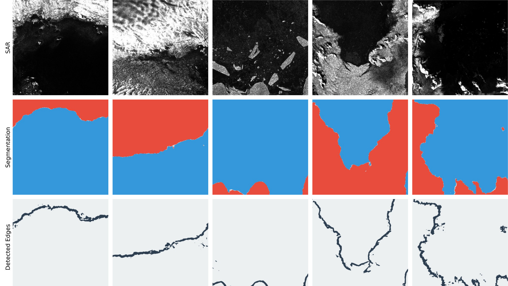
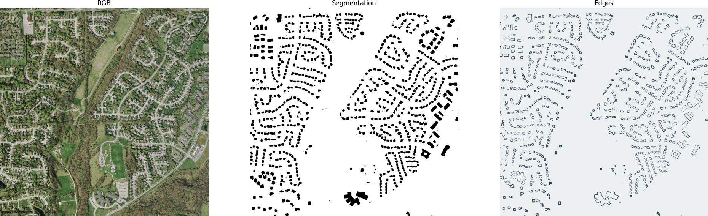
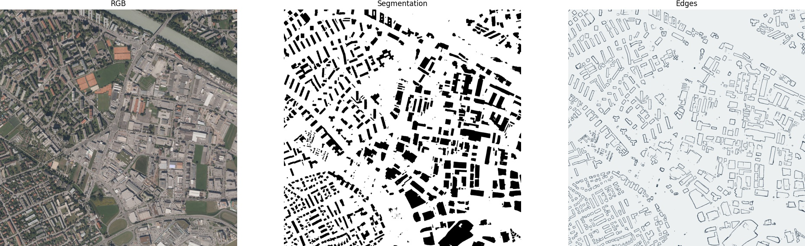
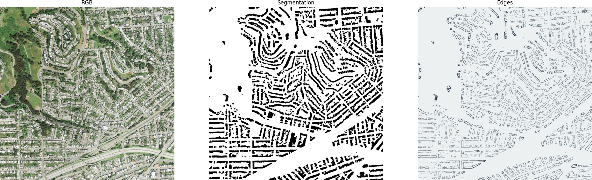

# HED-UNet

Code for HED-UNet, a model for simultaneous semantic segmentation and edge detection.

## Glacier Fronts

This model was originally developed to detect calving front margins in Antarctica from Sentinel-1 SAR imagery.



## Building Footprints

As the original dataset isn't publicly available, this repository contains an adaption of the model for building footprint extraction on the [Inria Aerial Image Labeling dataset](https://project.inria.fr/aerialimagelabeling/). Here are some example results:

##### Bloomington



##### Innsbruck



##### San Francisco



## Usage

In order to use this for your project, you will need adapt either the `get_dataloader` function in `train.py` or the methods in `data_loading.py`.

## Citation

If you find our code helpful and use it in your research, please use the following BibTeX entry.

```tex
@unpublished{HEDUNet2021,
  author =   {Heidler, Konrad and Mou, Lichao and Baumhoer, Celia and Dietz, Andreas and Zhu, Xiao Xiang},
  title =    {HED-UNet: Combined Segmentation and Edge Detection for Monitoring the Antarctic Coastline},
  journal =  {IEEE Transactions on Geoscience and Remote Sensing},
  year =     {2021},
  note =     {in press}
}
```
